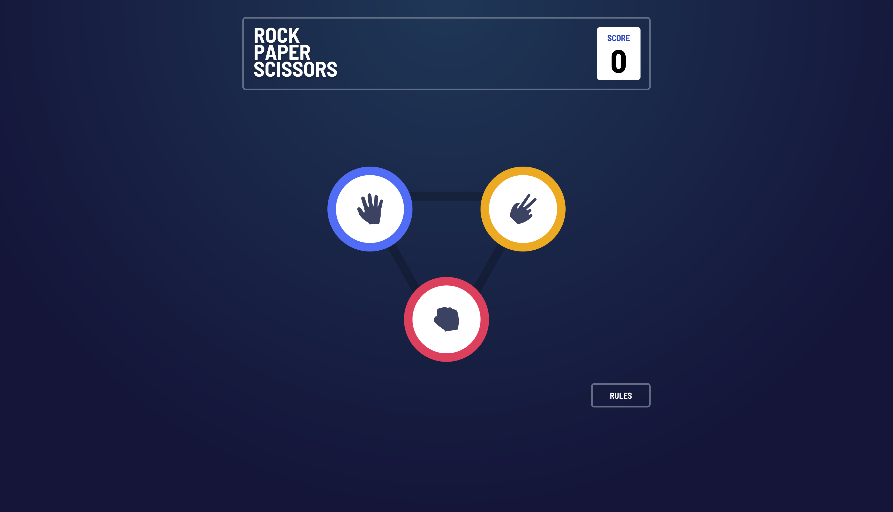
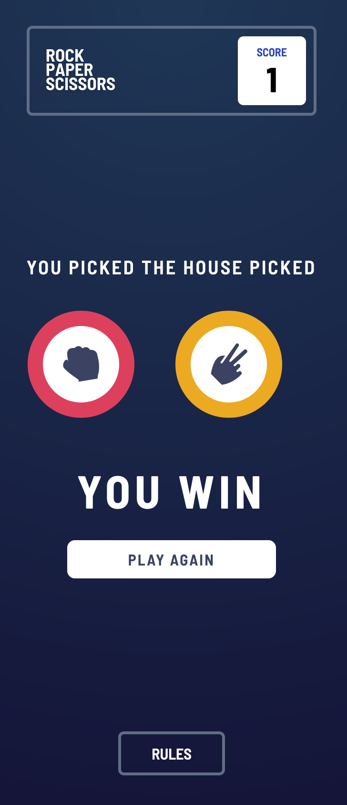
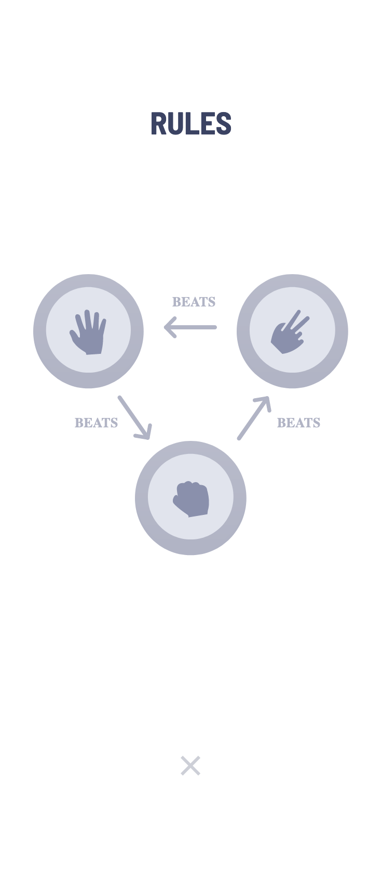
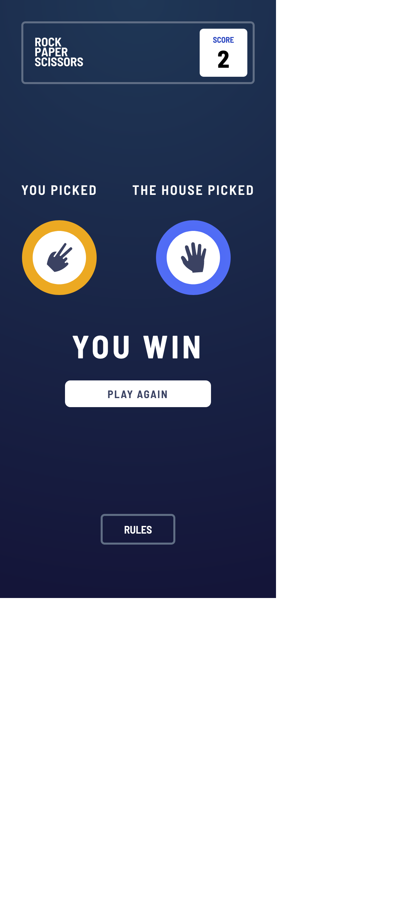

# Frontend Mentor - Rock, Paper, Scissors solution

This is a solution to the [Rock, Paper, Scissors challenge on Frontend Mentor](https://www.frontendmentor.io/challenges/rock-paper-scissors-game-pTgwgvgH). Frontend Mentor challenges help me improve my coding skills by building realistic projects.

## Table of contents

- [Overview](#overview)
  - [The challenge](#the-challenge)
  - [Screenshot](#screenshot)
  - [Links](#links)
- [My process](#my-process)
  - [Built with](#built-with)
  - [What I learned](#what-i-learned)
  - [Continued development](#continued-development)
  - [Useful resources](#useful-resources)
- [Author](#author)
- [Acknowledgments](#acknowledgments)

## Overview

### The challenge

Users should be able to:

- View the optimal layout for the game depending on their device's screen size
- Play Rock, Paper, Scissors against the computer

### Screenshot

### Links

- Solution URL: [Solution URL](https://github.com/ahmedsaliuGit/rock-paper-scissors)
- Live Site URL: [Live site URL here](https://ahmedsaliugit.github.io/rock-paper-scissors/)

## My process

### Built with

- Semantic HTML5 markup
- Flexbox
- CSS Grid
- Mobile-first workflow
- [React](https://reactjs.org/) - JS library
- [Tailwindcss](https://tailwindcss.com/) - For styles

### Continued development

To improve more on the app with optional features

### Useful resources

- [Resource 1](https://tailwindcss.com/docs) - This help me reinforcement tailwind knowledge

## Author

- Website - [Ahmed Saliu](https://github.com/ahmedsaliuGit/)
- Frontend Mentor - [@ahmedsaliuGit](https://www.frontendmentor.io/profile/ahmedsaliuGit)

## Acknowledgments

Kudos to Frontend mentor team for a wonderful platform.
